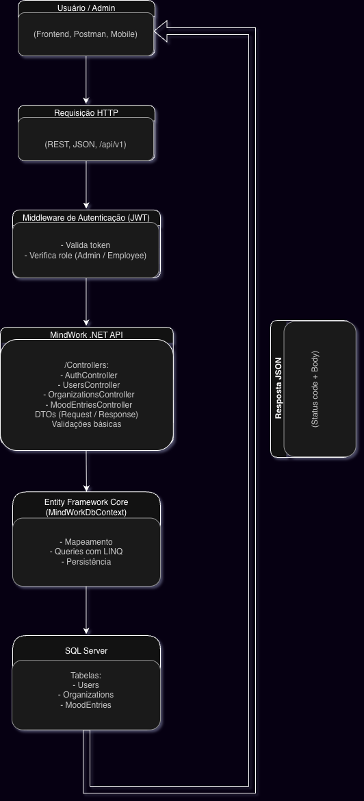

# MindWork .NET API

A MindWork .NET API é a versão em C# da solução desenvolvida para monitoramento de bem-estar emocional, permitindo que organizações registrem seus colaboradores, armazenem informações de humor (mood entries), e realizem análises básicas utilizando dados enviados manualmente ou automaticamente.

Esta API segue arquitetura REST, versionamento em `/api/v1`, autenticação por JWT, proteção de rotas, documentação por Swagger e persistência com Entity Framework Core + SQL Server.

---

## 🚀 Tecnologias Utilizadas

- **.NET 9 / C#**
- **Entity Framework Core**
- **SQL Server**
- **Swagger / OpenAPI**
- **JWT Authentication**
- **Versionamento de API**
- **Docker (opcional)**

---

## 🧱 Arquitetura e Estrutura

```
MindWork .NET API
 ├── Controllers/
 │     ├── AuthController.cs
 │     ├── UsersController.cs
 │     ├── OrganizationsController.cs
 │     └── MoodEntriesController.cs
 ├── DTOs/
 ├── Entities/
 ├── Data/
 ├── Program.cs
 └── MindWork.Api.csproj
```

A API é dividida em camadas simples, com controllers fazendo comunicação direta com o Entity Framework (ideal para projetos acadêmicos).

---

## 🔑 Autenticação & Segurança

A API utiliza **JWT (Bearer Token)** para proteger rotas.

### 🔓 Rotas públicas
- `POST /api/v1/users` → Registro de usuários (sempre com role Employee)
- `POST /api/v1/auth/login` → Login

### 🔐 Rotas protegidas (JWT obrigatório)
- Criar/editar/deletar organizações  
- Criar/editar/deletar usuários  
- Criar/Listar mood entries  
- Listagens filtradas por usuário ou organização  

### 👑 Rotas exclusivas para administradores
- Criar organização  
- Editar organização  
- Deletar organização  

---

## 📝 Endpoints Principais

### 🔐 Autenticação
#### **POST /api/v1/auth/login**
```json
{
  "email": "admin@mindwork.com",
  "password": "Admin123!"
}
```

Retorno:
```json
{
  "token": "eyJhbGciOiJIUzI1NiIsInR5cCI6IkpXVCJ9...",
  "userId": "...",
  "organizationId": "...",
  "name": "Admin Global",
  "email": "admin@mindwork.com",
  "role": "Admin"
}
```

---

## 👥 Users

### Criar usuário (rota pública)
POST `/api/v1/users`

### Listar usuários
GET `/api/v1/users`

### Buscar usuários por organização
GET `/api/v1/users/by-organization/{organizationId}`

### Editar usuário
PUT `/api/v1/users/{id}`

### Deletar usuário
DELETE `/api/v1/users/{id}`

---

## 🏢 Organizations

### Criar organização (ADMIN)
POST `/api/v1/organizations`

### Editar organização (ADMIN)
PUT `/api/v1/organizations/{id}`

### Deletar organização (ADMIN)
DELETE `/api/v1/organizations/{id}`

### Listar organizações
GET `/api/v1/organizations`

---

## 😊 Mood Entries

### Criar mood entry
POST `/api/v1/mood-entries`

### Listar todas
GET `/api/v1/mood-entries`

### Listar por usuário
GET `/api/v1/mood-entries/by-user/{userId}`

### Listar por organização
GET `/api/v1/mood-entries/by-organization/{organizationId}`

Não existe **PUT** ou **DELETE** para mood entries, assim como na versão Java.

---

## 🗂 Versionamento da API

Todas as rotas seguem o padrão:

```
/api/v1/...
```

A API é totalmente estruturada para futuras versões (`/api/v2`, `/api/v3`, ...).

---

## 🗄 Banco de Dados e Seed

Ao iniciar o projeto pela primeira vez:

- Uma organização padrão é criada: **MindWork HQ**
- Um usuário administrador é criado automaticamente:
  - Email: **admin@mindwork.com**
  - Senha: **Admin123!**
  - Role: **Admin**

---

## 🧪 Como Rodar o Projeto

### 1. Restaurar pacotes
```
dotnet restore
```

### 2. Ajustar string de conexão no `appsettings.json`
```json
"ConnectionStrings": {
  "DefaultConnection": "Server=localhost;Database=MindWorkDb;User Id=sa;Password=YourPassword123;"
}
```

### 3. Rodar a API
```
dotnet run --urls http://0.0.0.0:5000
```

### 4. Abrir o Swagger
Acesse:

```
http://localhost:5010/swagger
```

---

## 🧭 Fluxo Geral da Aplicação

1. Admin faz login  
2. Admin cria organizações  
3. Admin cadastra usuários  
4. Usuários logam  
5. Usuários enviam mood entries  
6. Organização analisa dados filtrados por:
   - usuário
   - equipe
   - organização inteira  

---

## 📊 Fluxo de Dados (Draw.io)

Abaixo está o diagrama que representa o fluxo completo da MindWork .NET API,
incluindo autenticação, versionamento, controllers e persistência com EF Core.



---

## 🎥 Vídeo Demonstrativo
📌 Link do vídeo: [](https://www.youtube.com/watch?v=gXZfBDXjkTs)

---

## 👨‍💻 Desenvolvedores

- **João Pedro Marques – RM98307**  
- **Kayky Paschoal Ribeiro – RM99929**  
- **Natan Eguchi dos Santos – RM98720**


